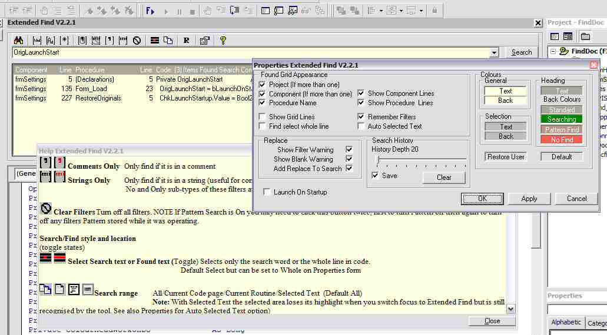



## Extended Find Ver 2\.2\.1

### Description

This is a VB6 only Add-In that is a substitute for VB's own Find & Replace tool. It allows you to search your code and to see at a glance all occurrences of a search phrase in a list. You can also do pattern searching (including an ASCII Search Macro to find high ASCII characters like copyright). You can search and replace at 3 levels (all code, current code or current routine). You can also limit searching to just comments or strings or block comments and strings from searches. The Tool docks with VB's IDE and can be set to display during VB's start up sequence. There is a simple Help window (or read the rtf file in the Zip.) and a Properties window that gives you greater control of how the tool looks and behaves.

To use: Compile the code, placing the dll in VB's own folder or whereever you keep your Add-Ins. Close VB and reopen it (WARNING VB may crash on exit; this is a problem with compiling Add-Ins, it should not happen later). Select the Add-in Manager and find the add-in called 'ExFind_D' check the 'Loaded/UnLoaded' and 'Load on Startup' checkboxes. This will add the Extended Find to the Add-ins menu. Click the menu item and read the help window for further settings. Because this tool uses a UserDocument it automatically remembers its size and location between runs.

Please inform me if you wish to create VB5 (should be easy) or even VB4 (may not be so easy) versions and include acknowlegment in code/help/comments.

If you wonder about the F> button on my toolbar in the screenshot use the 'Other Submissions' link and find my article on 'Full Compile'

Thanks to users of earlier versions especially Dream and Sub-Zero for all their help in debugging.

Comments, votes and bug reports welcome.

----

Version 2.2.1

Pattern Search button disables Whole Word and Case Sensitivity buttons(If you could turn them on Pattern search would fail)

To remove a single item from the Search History make sure the whole text is selected then press BackSpace.

Fixed bug that caused eternal loop if search phrase occurred in last line of code.

Removed Punctuation Aware; it is not needed for the program to opeate.

Cancel button displays properly.

Added macros to allow you to insert a NewLine or Tab character to the Replace combo.

Added Auto Pattern search Off if Search phrase does not contain any Pattern search characters.

Fixed Selected Range test can now cope with selection starting/ending properly. (was ignoring start/end of all lines in selection if Start/End were not at minimium/maximum values for whole range.)

Changed Filter Warning message to make it easier to read at a glance.

ver 2.2

Added Component and Procedure Line columns to Found Grid.

Added Selected Text Range; don't know that anyone ever uses this but it is part of VB's Find and Replace so here it is.

Rearranged Properties window

Ver 2.1

See Additional Notes in help: Not fixes but stuff that's in the code but not previously explained.

Added User selection of colours for Combos and Grid.

History is now saved in correct order.

Whole Word Filter automatically sets Punctuation Filter. Fixed bug Found List working properly

Improved the way Found Grid copes with editing changing the hidden line number that Extended Find uses to speed finding.

----

 
### More Info
 

             |
---                |---
**Submitted On**   |2003-07-07 11:13:32
**By**             |[Roger Gilchrist](https://github.com/Planet-Source-Code/PSCIndex/blob/master/ByAuthor/roger-gilchrist.md)
**Level**          |Advanced
**User Rating**    |4.7 (66 globes from 14 users)
**Compatibility**  |VB 6\.0
**Category**       |[Complete Applications](https://github.com/Planet-Source-Code/PSCIndex/blob/master/ByCategory/complete-applications__1-27.md)
**World**          |[Visual Basic](https://github.com/Planet-Source-Code/PSCIndex/blob/master/ByWorld/visual-basic.md)
**Archive File**   |[Extended\_F161098762003\.zip](https://github.com/Planet-Source-Code/roger-gilchrist-extended-find-ver-2-2-1__1-46543/archive/master.zip)

